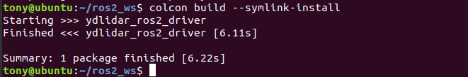
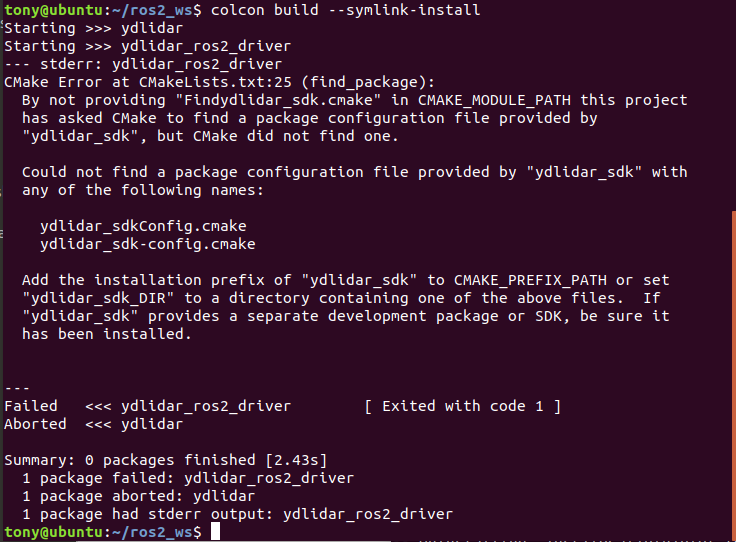
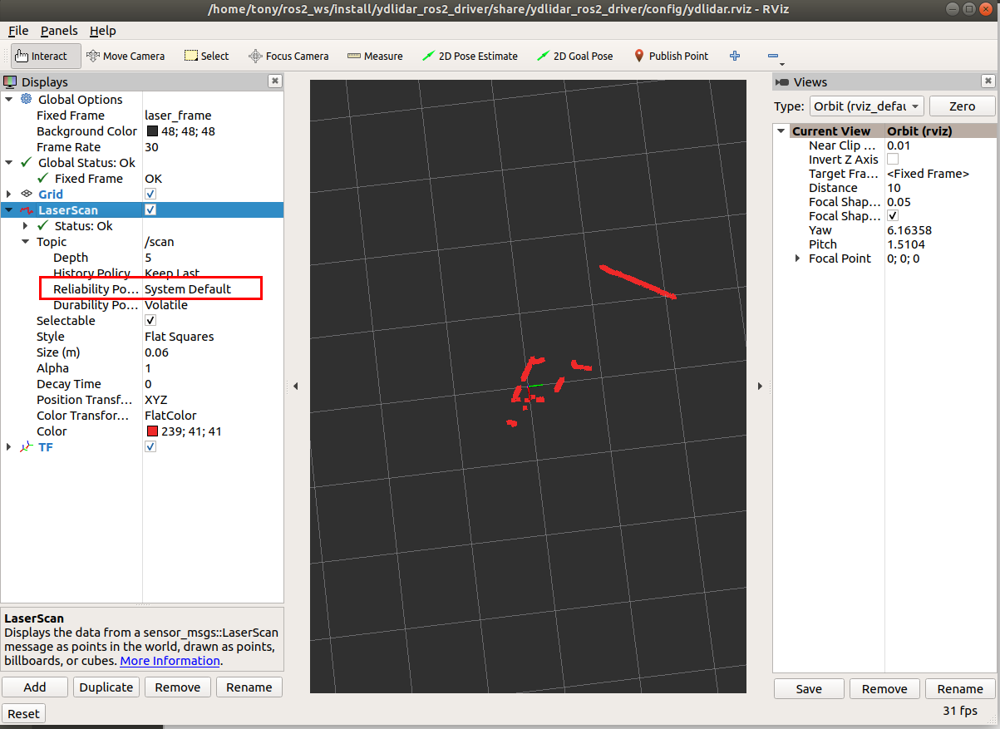

# YDLIDAR ROS2 Driver

xycar_lidar is a new ros package, which is designed to gradually become the standard driver package for ydlidar devices in the ros2 environment.

## How to [install ROS2](https://index.ros.org/doc/ros2/Installation)
[ubuntu](https://index.ros.org/doc/ros2/Installation/Dashing/Linux-Install-Debians/)

[windows](https://index.ros.org/doc/ros2/Installation/Dashing/Windows-Install-Binary/)

## How to Create a ROS2 workspace
[Create a workspace](https://index.ros.org/doc/ros2/Tutorials/Colcon-Tutorial/#create-a-workspace)


## Compile & Install YDLidar SDK

xycar_lidar depends on YDLidar-SDK library. If you have never installed YDLidar-SDK library or it is out of date, you must first install YDLidar-SDK library. If you have installed the latest version of YDLidar-SDK, skip this step and go to the next step.

1. Download or clone the [YDLIDAR/YDLidar-SDK](https://github.com/YDLIDAR/YDLidar-SDK) repository on GitHub.
2. Compile and install the YDLidar-SDK under the ***build*** directory following `README.md` of YDLIDAR/YDLidar-SDK.

## Clone xycar_lidar

1. Clone xycar_lidar package for github : 

   `git clone https://github.com/YDLIDAR/xycar_lidar.git ydlidar_ros2_ws/src/xycar_lidar`

2. Build xycar_lidar package :

   ```
   cd ydlidar_ros2_ws
   colcon build --symlink-install
   ```
   Note: install colcon [see](https://index.ros.org/doc/ros2/Tutorials/Colcon-Tutorial/#install-colcon)

   

   <font color=Red size=4>>Note: If the following error occurs, Please install  [YDLIDAR/YDLidar-SDK](https://github.com/YDLIDAR/YDLidar-SDK) first.</font>

   

3. Package environment setup :

   `source ./install/setup.bash`

    Note: Add permanent workspace environment variables.
    It's convenientif the ROS2 environment variables are automatically added to your bash session every time a new shell is launched:
    ```
    $echo "source ~/ydlidar_ros2_ws/install/setup.bash" >> ~/.bashrc
    $source ~/.bashrc
    ```
4. Confirmation
    To confirm that your package path has been set, printenv the `grep -i ROS` variable.
    ```
    $ printenv | grep -i ROS
    ```
    You should see something similar to:
        `OLDPWD=/home/tony/ydlidar_ros2_ws/install`

5. Create serial port Alias [optional] 
    ```
	$chmod 0777 src/xycar_lidar/startup/*
	$sudo sh src/xycar_lidar/startup/initenv.sh
    ```
    Note: After completing the previous operation, replug the LiDAR again.
	
## Configure LiDAR [paramters](params/ydlidar.yaml)
```
xycar_lidar_node:
  ros__parameters:
    port: /dev/ttyUSB0
    frame_id: laser_frame
    ignore_array: ""
    baudrate: 230400
    lidar_type: 1
    device_type: 0
    sample_rate: 9
    abnormal_check_count: 4
    resolution_fixed: true
    reversion: true
    inverted: true
    auto_reconnect: true
    isSingleChannel: false
    intensity: false
    support_motor_dtr: false
    angle_max: 180.0
    angle_min: -180.0
    range_max: 64.0
    range_min: 0.01
    frequency: 10.0
    invalid_range_is_inf: false
```

## Run xycar_lidar

##### Run xycar_lidar using launch file

The command format is : 

 `ros2 launch xycar_lidar [launch file].py`

1. Connect LiDAR uint(s).
   ```
   ros2 launch xycar_lidar ydlidar_launch.py 
   ```
   or 

   ```
   launch $(ros2 pkg prefix xycar_lidar)/share/xycar_lidar/launch/ydlidar.py 
   ```
2. RVIZ 
   ```
   ros2 launch xycar_lidar ydlidar_launch_view.py 
   ```
    

3. echo scan topic
   ```
   ros2 run xycar_lidar xycar_lidar_client or ros2 topic echo /scan
   ```

#####  Launch file introduction

The driver offers users a wealth of options when using different launch file. The launch file directory    

is `"ydlidar_ros2_ws/src/xycar_lidar/launch"`. All launch files are listed as below : 

| launch file               | features                                                     |
| ------------------------- | ------------------------------------------------------------ |
| ydlidar.py         | Connect to defualt paramters<br/>Publish LaserScan message on `scan` topic |
| ydlidar_launch.py         | Connect ydlidar.yaml Lidar specified by configuration parameters<br/>Publish LaserScan message on `scan` topic |
| ydlidar_launch_view.py         | Connect ydlidar.yaml Lidar specified by configuration parameters and setup RVIZ<br/>Publish LaserScan message on `scan` topic |


## Publish Topic
| Topic                | Type                    | Description                                      |
|----------------------|-------------------------|--------------------------------------------------|
| `scan`               | sensor_msgs/LaserScan   | 2D laser scan of the 0-angle ring                |

## Subscribe Service
| Service                | Type                    | Description                                      |
|----------------------|-------------------------|--------------------------------------------------|
| `stop_scan`          | std_srvs::Empty   | turn off lidar                                         |
| `start_scan`         | std_srvs::Empty   | turn on lidar                                          |


## Configure ydlidar_ros_driver internal parameter

The xycar_lidar internal parameters are in the launch file, they are listed as below :

| Parameter name | Data Type | detail                                                       |
| -------------- | ------- | ------------------------------------------------------------ |
| port         | string | Set Lidar the serial port or IP address <br/>it can be set to `/dev/ttyUSB0`, `192.168.1.11`, etc. <br/>default: `/dev/ydlidar` |
| frame_id     | string | Lidar TF coordinate system name. <br/>default: `laser_frame` |
| ignore_array | string | LiDAR filtering angle area<br/>eg: `-90, -80, 30, 40` |
| baudrate     | int | Lidar baudrate or network port. <br/>default: `230400` |
| lidar_type     | int | Set lidar type <br/>0 -- TYPE_TOF<br/>1 -- TYPE_TRIANGLE<br/>2 -- TYPE_TOF_NET <br/>default: `1` |
| device_type     | int | Set device type <br/>0 -- YDLIDAR_TYPE_SERIAL<br/>1 -- YDLIDAR_TYPE_TCP<br/>2 -- YDLIDAR_TYPE_UDP <br/>default: `0` |
| sample_rate     | int | Set Lidar Sample Rate. <br/>default: `9` |
| abnormal_check_count     | int | Set the number of abnormal startup data attempts. <br/>default: `4` |
| fixed_resolution     | bool | Fixed angluar resolution. <br/>default: `true` |
| reversion     | bool | Reversion LiDAR. <br/>default: `true` |
| inverted     | bool | Inverted LiDAR.<br/>false -- ClockWise.<br/>true -- CounterClockWise  <br/>default: `true` |
| auto_reconnect     | bool | Automatically reconnect the LiDAR.<br/>true -- hot plug. <br/>default: `true` |
| isSingleChannel     | bool | Whether LiDAR is a single-channel.<br/>default: `false` |
| intensity     | bool | Whether LiDAR has intensity.<br/>true -- G2 LiDAR.<br/>default: `false` |
| support_motor_dtr     | bool | Whether the Lidar can be started and stopped by Serial DTR.<br/>default: `false` |
| angle_min     | float | Minimum Valid Angle.<br/>default: `-180` |
| angle_max     | float | Maximum Valid Angle.<br/>default: `180` |
| range_min     | float | Minimum Valid range.<br/>default: `0.1` |
| range_max     | float | Maximum Valid range.<br/>default: `16.0` |
| frequency     | float | Set Scanning Frequency.<br/>default: `10.0` |
| invalid_range_is_inf     | bool | Invalid Range is inf.<br/>true -- inf.<br/>false -- 0.0.<br/>default: `false` |
More paramters details, see [here](details.md)

## Contact EAI


If you have any extra questions, please feel free to [contact us](http://www.ydlidar.cn/cn/contact)


